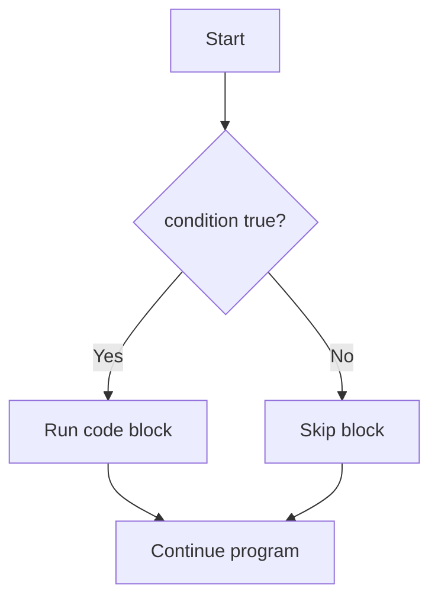
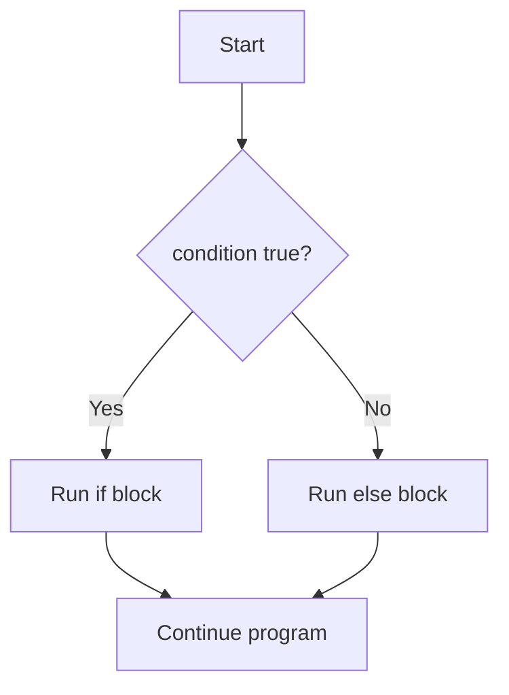
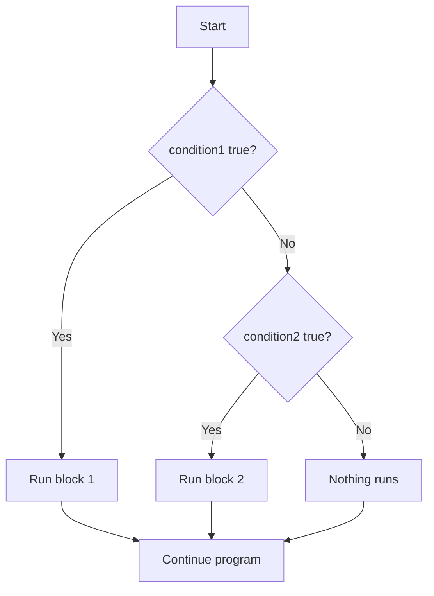
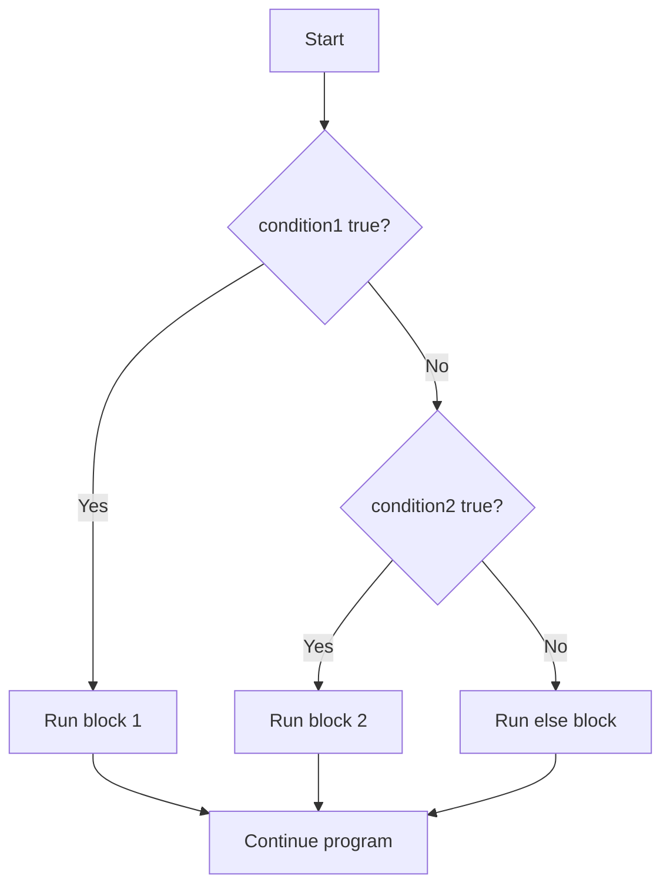

# Java Tutorial / Guide
 

## Table of Contents
- Java Basic Syntax
    - [Java Syntax](#java-syntax)
    - [Data Types](#data-types)
    - [Variable Declaration](#variable-declaration)

- Variable Assignments
    - [Declaration with Assignment (Combined)](#declaration-with-assignment-combined)
    - [Declaration, Then Assignment Later](#declaration-then-assignment-later)

- Java Arithmetic, Print Statement, and Logical Operators
    - [Arithmetic Operators](#arithmetic-operators)
    - [Compound Assignment Operators](#compound-assignment-operators)
    - [Print Statement](#print-statement)
    - [String Concatenation](#string-concatenation)
    - [Logical Operators](#logical-operators)
- Java Conditional Statements
    - [If Statement](#if-statement)
    - [If • Else Statement](#if--else-statement)
    - [If • Else-If Statement](#if--else-if-statement)
    - [If • Else-If • Else Statement](#if--else-if--else-statement)
    - [Switch Statement](#switch-statement)

- [Increment and Decrement Operators](#increment-and-decrement-operators)
- Java Loop Statements
    - [While Loop](#while-loop)
    - [Do-While Loop](#do-while-loop)
    - [For Loop](#for-loop)

---
# Java Syntax
Java programs are organized into classes, and every Java application starts in a `main` method.

```java
public class Main {
    public static void main(String[] args) {
        // code starts here
    }
}
```

> `public` - access modifier, tells Java that this class or method can be accessed from outside its own class
>
> `class` - Java keyword used to define a class
>
> `Main` - a custom class name chosen by the programmer; it should begin with a capital letter
>
> `static` - tells Java this method belongs to the class itself
>
> `void` - means the method does not return a value
>
> `main` - the required method name where the program starts running
>
> `String[] args` - stores command-line arguments passed to the program

The class name and the method name are different things.
- `Main` is the name of the class you create.
- `main` is the special method Java looks for when the program starts.

Example:
```java
public class HelloKitty {
    public static void main(String[] args) {
        System.out.println("Hello, Kitty!");
    }
}
```
> If the class name is `HelloKitty`, the file should usually be saved as `HelloKitty.java`.

---
## Writing code
Java code can be written on one line or across multiple lines. The compiler does not care much about spaces, but proper indentation makes the code easier to read.

Single line:
```java
public class Main { public static void main(String[] args) {} }
```

Multiline with inconsistent indentation:
```java
public class Main {
         public static void main(String[] args) {
// comment
  }
    }
```

For readability, we usually format it neatly:
```java
public class Main {
    public static void main(String[] args) {
        // comment
    }
}
```

> Use tabs or spaces to indent your code consistently.
>
> Clean formatting helps you and other programmers read the code more easily.

---
# Data Types
A data type tells Java what kind of value a variable can store. Java has primitive types and reference types.

## Primitive Data Types
| Type | Description | Example |
|---|---|---|
| `char` | Stores a single character in single quotes | `'a'`, `'B'`, `'!'` |
| `byte` | Small integer value | `-128` to `127` |
| `short` | Small integer value | `-32,768` to `32,767` |
| `int` | Common integer type | `-2,147,483,648` to `2,147,483,647` |
| `long` | Large integer value | `123456789012L` |
| `float` | Decimal number with less precision | `3.14f` |
| `double` | Decimal number with more precision | `3.1415926535` |

## Reference Data Types
| Type | Description | Example |
|---|---|---|
| `String` | A sequence of characters | `"Hello"` |
| `Scanner` | A class from `java.util` used to read input | `Scanner input = new Scanner(System.in);` |

> Primitive types store simple values like numbers and characters directly.
>
> Reference types store objects or classes, such as `String` and `Scanner`.

Example:
```java
int age = 21;
double price = 19.99;
char grade = 'A';
String name = "Alice";
```

> `int` holds whole numbers.
>
> `double` holds decimal numbers.
>
> `char` holds one character.
>
> `String` holds text.

---

# Variable Declaration
- Syntax = datatype identifier
```java
int number;
```
> int - Data type
>
> number - User defined identifier
>
> semicolon( ; ) - Used as a line ender

- We can declare multiple variables with different types.
```java
int number;
boolean areYouSure;
char character;
```
> These declarations can be written on multiple lines or on a single line.
```java
int number; boolean areYouSure; char character;
```
You can also make this multi-line declaration of variables with same type on a single line.
```java
int numOne;
int numTwo;
int numThree;
```
or
```java
int numOne, numTwo, numThree;
```
> The data type is omitted and variables are separated with comma.

Actual source code
```java
public class Main{ 
    public static void main( String[] args ){
        // We can declare multiple variables with different types.
        int number;
        boolean areYouSure;
        char character;

        // You can also write declaration of variables with same data type on a single line.
        int numOne, numTwo, numThree;
        // The data type is omitted and variables are separated with comma.
    } 
}
```
# Variable Value Assignment
---
## Declaration with Assignment (Combined)
Creates the variable and gives it a value in a single line — the most common way to write it.
```java
dataType variableName = value;
```
> dataType - the kind of value being stored (int, double, String, boolean, etc.)
>
> variableName - the identifier you'll use to refer to this value later
>
> value - the initial value, assigned the moment the variable is created

Example
```java
int age = 21;

System.out.println(age); // 21
```
> age is declared as an int and immediately given the value 21 — both steps happen in one statement.
- This is the most common style since it's short and the variable is never left without a value.

---
## Declaration, Then Assignment Later
Splits the process into two steps — the variable is declared first, and given a value at some point afterward.
```java
dataType variableName;

// ... some other code may run here ...

variableName = value;
```
> Declaring without assigning gives the variable a name and type, but no value yet.
>
> The variable must be assigned a value before it's read anywhere — Java won't compile if you try to use it while still empty
>
> This pattern is useful when the value isn't known yet at the point of declaration — e.g., it depends on user input, a calculation, or a condition checked later

Example
```java
int score;

score = 75;

System.out.println(score); // 75
```
> score is declared first with no value. It's only usable once the second line, score = 75;, actually gives it one.
- If System.out.println(score) had been placed before score = 75;, the code wouldn't compile — Java requires local variables to be assigned before they're used.


# Java Arithmetic, Print Statement, and Logical Operators
# Arithmetic Operators
Performs basic math calculations on numeric data types like `int`, `double`, and `float`.
```java
int sum        = a + b;   // addition
int difference = a - b;   // subtraction
int product    = a * b;   // multiplication
int quotient   = a / b;   // division
int remainder  = a % b;   // modulo (remainder after division)
```
> + - adds two values
>
> - - subtracts the right value from the left value
>
> * - multiplies two values
>
> / - divides the left value by the right value
>
> % - returns the remainder of a division

Example
```java
int a = 17;
int b = 5;

System.out.println(a + b); // 22
System.out.println(a - b); // 12
System.out.println(a * b); // 85
System.out.println(a / b); // 3
System.out.println(a % b); // 2
```
> a / b prints 3, not 3.4 — when both operands are int, Java performs integer division and drops the decimal part. a % b prints 2, the amount left over after 17 ÷ 5.
- If you need the decimal part, make at least one operand a double (e.g., `17.0 / 5`).

---
## Compound Assignment Operators
Shorthand operators that combine an arithmetic operation with assignment in a single step.
```java
variable += value;   // same as: variable = variable + value
variable -= value;   // same as: variable = variable - value
variable *= value;   // same as: variable = variable * value
variable /= value;   // same as: variable = variable / value
variable %= value;   // same as: variable = variable % value
```
> These operators update the variable in place — you don't have to type its name twice
>
> They work with any numeric data type (int, double, float, etc.)

Example
```java
int score = 50;

score += 10; // score is now 60
score *= 2;  // score is now 120
score -= 20; // score is now 100
score /= 4;  // score is now 25

System.out.println(score); // 25
```
> Each line updates score using its own previous value, so the changes stack on top of each other in order — ending at 25.

---
# Print Statement
Displays output to the console. `print()` keeps the cursor on the same line, while `println()` moves it to a new line afterward.
```java
System.out.print( value );
System.out.println( value );
```
> System.out - refers to the standard output stream (the console)
>
> print() - Java method, displays the value without moving to a new line afterward
>
> println() - Java method, displays the value and then moves to a new line

Example
```java
System.out.print("Hello, ");
System.out.println("World!");
System.out.println("Java is fun.");
```
> The output appears as:
> Hello, World!
> Java is fun.
- Since print() doesn't add a line break, "World!" continues right after "Hello, " on the same line. println() then breaks the line for the next statement.

### Using printf
`printf()` is useful when you want to format output with placeholders.

```java
System.out.printf("Hello %s", "Java");
System.out.printf("Age: %d", 21);
System.out.printf("Price: %.2f", 19.99f);
```

> `%s` - string placeholder
>
> `%d` - integer placeholder
>
> `%.2f` - float/double placeholder with 2 decimal places

`%n` is a special newline format specifier used inside `printf()`.

```java
System.out.printf("Hello %s%n", "Java");
System.out.printf("Age: %d%n", 21);
System.out.printf("Price: %.2f%n", 19.99f);
```

> `%n` moves the output to the next line.
>
> It is used separately from `%s`, `%d`, and `%.2f`.

Without `%n`:
```java
System.out.printf("Name: %s", name);
System.out.printf("Age: %d", age);
System.out.printf("Height: %.2f", height);
```

Output:
```text
Name: AliceAge: 18Height: 1.72
```

With `%n`:
```java
System.out.printf("Name: %s%n", name);
System.out.printf("Age: %d%n", age);
System.out.printf("Height: %.2f%n", height);
```

Output:
```text
Name: Alice
Age: 18
Height: 1.72
```

> `printf()` gives you more control over how values are displayed.
>
> `%n` is especially useful when you want to move to the next line inside `printf()`.

---
## String Concatenation
Joins strings and values together using the `+` operator — either while building a variable, or directly inside a print statement.
```java
String message = "Hello, " + name;        // building a variable
System.out.println("Score: " + score);    // directly inside print()
```
> + - when placed between a String and another value, Java converts that value to text and joins it
>
> Concatenation can happen while assigning to a variable, or directly as an argument inside print()
>
> Wrap a numeric calculation in parentheses if you want it solved first — otherwise Java just concatenates left to right instead of doing the math

Example
```java
int a = 5;
int b = 3;

String label = "Values: " + a + ", " + b;
System.out.println(label);

System.out.println("Without parentheses: " + a + b);
System.out.println("With parentheses: " + (a + b));
```
> "Values: " + a + ", " + b prints Values: 5, 3 — each + just appends the next piece as text, left to right.
- "Without parentheses: " + a + b prints Without parentheses: 53. Java evaluates left to right, so "Without parentheses: " + a becomes a String first, and + b then just appends "3" as text instead of adding it.
- "With parentheses: " + (a + b) prints With parentheses: 8. The parentheses force 5 + 3 to be calculated first, and only the result (8) gets turned into text.

---
# Logical Operators
Combines or reverses boolean conditions to control more complex decision-making.
```java
condition1 && condition2   // AND - true only if both sides are true
condition1 || condition2   // OR  - true if at least one side is true
!condition                 // NOT - reverses a condition's boolean value
```
> && - Java operator, true only when both sides are true
>
> || - Java operator, true when at least one side is true
>
> ! - Java operator, flips true to false or false to true

Example
```java
boolean isRaining = false;

if( !isRaining ){
    System.out.println("Good day for a walk");
}

int age = 20;
boolean hasID = true;

if( age >= 18 && hasID ){
    System.out.println("Entry allowed");
}
```
> !isRaining flips false into true, so the first message prints.
- age >= 18 is true and hasID is true, so both sides of && are true and "Entry allowed" prints. If either one were false, the whole && condition would be false and nothing would print.
---
# Java Conditional Statements

# If Statement
Runs a block of code only when a condition evaluates to true.
```java
if( condition ){
    // code
}
```

> if - Java keyword
>
> condition - a boolean expression enclosed in parentheses ( e.g., score >= 75 )
>
> { } - code block that only runs when the condition is true

Example
```java
int score = 85;

if( score >= 75 ){
    System.out.println("Passed");
}
```
> Since score is 85, and 85 >= 75 is true, "Passed" gets printed.
- If the condition were false, the block is simply skipped and the program continues right after it.
- There is no alternative here — if the condition is false, nothing happens.

---
## If • Else Statement
Adds an alternative block that runs only when the condition is false.
```java
if( condition ){
    // runs when true
} else {
    // runs when false
}
```

> if - starts the condition check
>
> else - Java keyword, defines the alternative block
>
> Only one of the two blocks will ever run, never both

Example
```java
int score = 60;

if( score >= 75 ){
    System.out.println("Passed");
} else {
    System.out.println("Failed");
}
```
> Since 60 >= 75 is false, the else block runs and prints "Failed".

---
## If • Else-If Statement
Checks multiple conditions in order, stopping at the first one that's true.
```java
if( condition1 ){
    // runs if condition1 is true
} else if( condition2 ){
    // runs if condition1 is false AND condition2 is true
}
```

> else if - Java keyword pair, only checked if the condition(s) before it were false
>
> You can chain as many else if blocks as you need
>
> If none of the conditions are true, nothing runs at all — there's no fallback block here

Example
```java
int score = 82;

if( score >= 90 ){
    System.out.println("Grade: A");
} else if( score >= 80 ){
    System.out.println("Grade: B");
} else if( score >= 70 ){
    System.out.println("Grade: C");
}
```
> Java checks score >= 90 first (false), then score >= 80 (true) → prints "Grade: B" and skips the remaining checks.

---
## If • Else-If • Else Statement
Same idea as if-else if, but ends with a final block that runs when none of the conditions above it are true.
```java
if( condition1 ){
    // runs if condition1 is true
} else if( condition2 ){
    // runs if condition2 is true
} else {
    // runs if none of the above are true
}
```

> The final else has no condition of its own — it's the catch-all
>
> This guarantees that exactly one block will always run

Example
```java
int score = 40;

if( score >= 90 ){
    System.out.println("Grade: A");
} else if( score >= 80 ){
    System.out.println("Grade: B");
} else if( score >= 70 ){
    System.out.println("Grade: C");
} else {
    System.out.println("Grade: F");
}
```
> Since none of the conditions (>=90, >=80, >=70) are true, the final else runs and prints "Grade: F".

Source code implementation
```java
public class Main{
    public static void main( String[] args ){
        
        int score = 82;

        // if • else if • else, chain
        if( score >= 90 ){
            System.out.println("Grade: A");
        } else if( score >= 80 ){
            System.out.println("Grade: B");
        } else if( score >= 70 ){
            System.out.println("Grade: C");
        } else {
            System.out.println("Grade: F");
        }
    }
}
```

---
# Switch Statement
A switch statement is used when you want to compare one value against several possible cases.

```java
int day = 3;

switch (day) {
    case 1:
        System.out.println("Monday");
        break;
    case 2:
        System.out.println("Tuesday");
        break;
    case 3:
        System.out.println("Wednesday");
        break;
    default:
        System.out.println("Other day");
        break;
}
```

> switch - Java keyword
>
> day - the value being checked
>
> case - each possible value to compare against
>
> break - stops the switch after a matching case
>
> default - runs when no case matches

> Since `day` is 3, the program matches `case 3` and prints `Wednesday`.

### What happens without `break`?
If you do not use `break`, Java will continue running the next case blocks even after a match is found. This is called fall-through.

```java
int day = 3;

switch (day) {
    case 1:
        System.out.println("Monday");
    case 2:
        System.out.println("Tuesday");
    case 3:
        System.out.println("Wednesday");
    default:
        System.out.println("Other day");
}
```

> Without `break`, once `case 3` matches, Java keeps going and executes the next cases too.
>
> The output becomes:
>
> Wednesday
>
> Other day
>
> This is why `break` is important in a switch statement.

---
## Increment and Decrement Operators
The `++` operator increases a value by 1, and `--` decreases a value by 1.

```java
int count = 0;

count++;
System.out.println(count); // 1

count--;
System.out.println(count); // 0

++count;
System.out.println(count); // 1

--count;
System.out.println(count); // 0
```

> `count++` is called postfix increment. It uses the old value first, then increases it.
>
> `++count` is called prefix increment. It increases the value first, then uses it.
>
> `count--` is postfix decrement. It uses the old value first, then decreases it.
>
> `--count` is prefix decrement. It decreases the value first, then uses it.
>
> These operators are often used in loops to move from one value to the next.

Assignment example:
```java
int x = 5;

int a = x++;
System.out.println(a); // 5
System.out.println(x); // 6

int b = ++x;
System.out.println(b); // 7
System.out.println(x); // 7
```

> In `int a = x++;`, Java stores the old value of `x` in `a`, then increases `x`.
>
> In `int b = ++x;`, Java increases `x` first, then stores the new value in `b`.
>
> The difference is visible in the assigned value and the final value of `x`.

---
# While Loop
A while loop is very similar to an `if` statement because both check a condition first.

```java
int count = 0;

if (count < 5) {
    System.out.println(count);
}

while (count < 5) {
    System.out.println(count);
    count++;
}
```

> `if` runs its block only once when the condition is true.
>
> `while` runs its block repeatedly as long as the condition stays true.
>
> In other words, an `if` statement checks once, while a `while` loop keeps checking again and again.

Example:
```java
int count = 0;

while (count < 5) {
    System.out.println(count);
    count++;
}
```

Output:
```text
0
1
2
3
4
```

> The condition is checked before the loop body runs.
>
> If the condition is false at the start, the loop body never executes.

### When the condition never reaches false
A while loop can keep running when its update moves the condition away from becoming false.

```java
int i = 0;

while (i < 3) {
    i--;
}
```

> Since `i` keeps decreasing, `i < 3` stays true for a very long time. However, `int` eventually overflows, so this loop eventually ends; it is not truly infinite.

An always-true condition does not reach `false`:

```java
while (true) {
    System.out.println("Repeating");
}
```

> The condition is always `true`, so it never reaches `false` and the loop keeps repeating.

> Unlike the `int` example above, this loop is infinite unless something else stops it.


---
# Do-While Loop
A do-while loop runs the code block at least once before checking the condition.

```java
int count = 0;

do {
    System.out.println(count);
    count++;
} while (count < 5);
```

Output:
```text
0
1
2
3
4
```

> The body runs first, then the condition is checked.
>
> This guarantees the loop executes at least once.

---
# For Loop
A for loop repeats a block of code while its condition is true. It is commonly used when you know how many times to repeat.

### Parts of a for loop
- Initialization: runs once before the loop begins.
- Condition: decides whether the loop continues.
- Update: changes the value after each cycle.

Example:
```java
for (int i = 0; i < 5; i++) {
    System.out.println(i);
}
```

Output:
```text
0
1
2
3
4
```

> `int i = 0` → initialization
>
> `i < 5` → condition
>
> `i++` → update

Example with comments:
```java
for (int i = 0; i < 5; i++) {
    // initialization: int i = 0
    // condition: i < 5
    // update: i++
    System.out.println(i);
}
```

> The loop starts with `int i = 0`.
>
> It keeps running while `i < 5` is true.
>
> After each cycle, `i++` updates the value.

### Boolean condition example
A condition can also be a direct boolean value.

```java
for (int i = 0; true; i++) {
    System.out.println(i);
}
```

> A condition set to `true` never becomes false.
>
> Because of that, the loop never stops unless something else interrupts it.
>
> This creates an infinite loop.

### Multiple variables in one loop
```java
for (int i = 0, x = 0; i < 3; i++, x--) {
    System.out.println("i = " + i + ", x = " + x);
}
```

> More than one variable can be initialized and updated in the same `for` loop.

---
