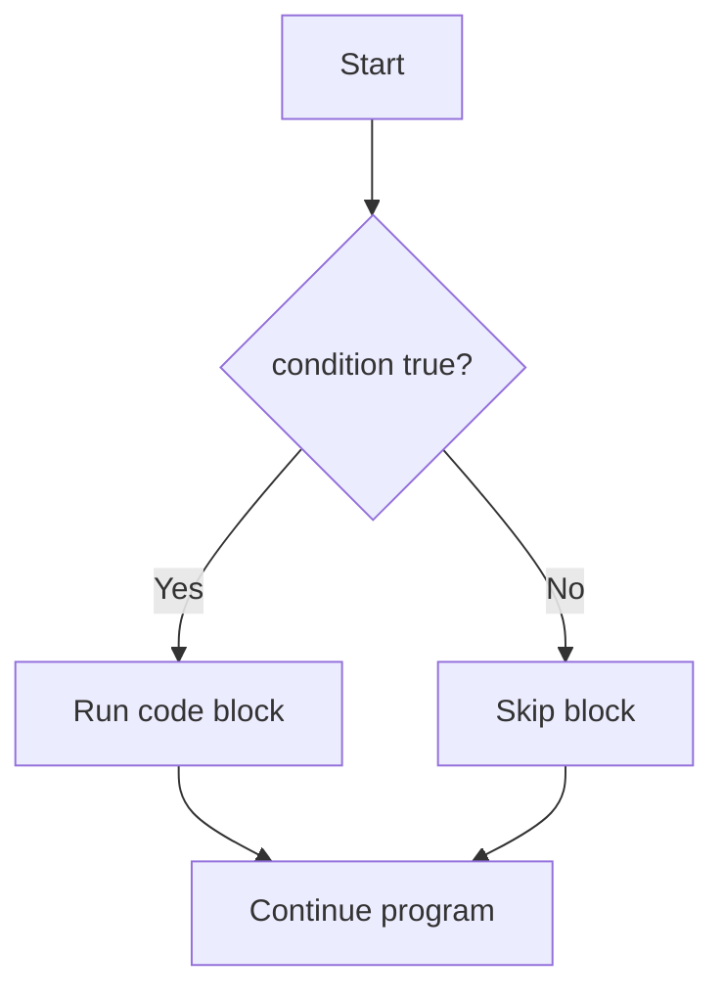
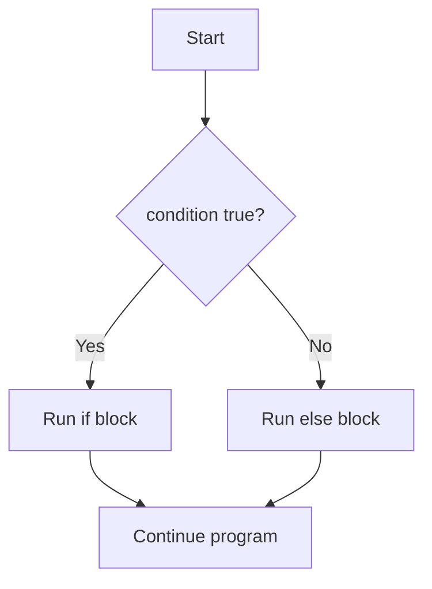
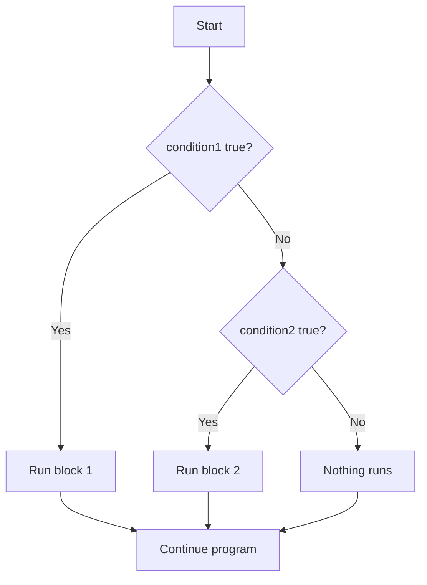
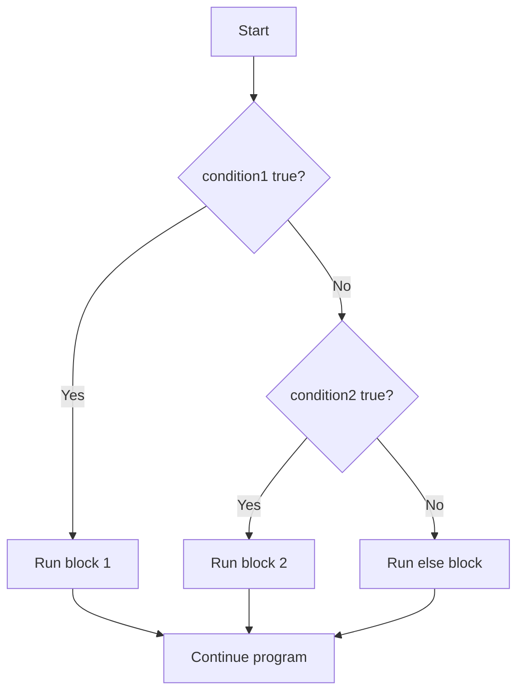

# Java Tutorial / Guide
 

## Table of Contents
- Java Basic Syntax
    - [Java Syntax](#java-syntax)
    - [Data Types](#data-types)
    - [Variable Declaration](#variable-declaration)

- Variable Assignments
    - [Declaration with Assignment (Combined)](#declaration-with-assignment-combined)
    - [Declaration, Then Assignment Later](#declaration-then-assignment-later)

- Java Arithmetic, Print Statement, and Logical Operators
    - [Arithmetic Operators](#arithmetic-operators)
    - [Compound Assignment Operators](#compound-assignment-operators)
    - [Print Statement](#print-statement)
    - [String Concatenation](#string-concatenation)
    - [Logical Operators](#logical-operators)
- Java Conditional Statements
    - [If Statement](#if-statement)
    - [If-Else Statement](#if-else-statement)
    - [If-Else If Statement](#if-else-if-statement)
    - [If-Else If-Else Statement](#if-else-if-else-statement)

---
# Java Syntax
Java class definition
```java
public class Main{}
```
> public - Java access modifier
>
> class - Java keyword 
>
> Main­ - Identifier, a user defined name or label ( Eg. MyClass, Hellokitty, MaaMaaaa ). Should always start with capital letter.

This function definition will be the entry point of the program and will be placed inside the "_Main class_".
```java
public static void main( String[] args ){}
``` 
> public - Java access modifier
>
> static - Non-access modifier keyword for methods and attributes.
>
> void - Return data type
>
> main - A required method identifier for program entry point.

When put together it will look like... ```Main class{ main method }```
```java
public class Main{ public static void main( String[] args ){} }
```
- Note that the ```Main``` class and ```main``` method are different identifiers
- The ```Main``` inside ```public class Main``` is a custom identifier, you can change it but the source code's file name should also be saved under this class name.
> Example : 
>
> public class Main{} -> saved to _Main.java_
>
> public class HelloKitty{} -> saved to _HelloKitty.java_
- While the ```main``` inside the ```public static void main( String[] args )``` is a fixed identifier.
---
## Writing code
The source code can be written on a single line or multiline with indentations.
- Single line
```java
public class Main{ public static void main( String[] args ){} }
```
- Multiline with inconsistent indentations
```java
public class Main{ 
         public static void main( String[] args ){
// Comment - start of program
  } 
    }
```
- We can write codes like this and it will run perfectly fine since Java compiler isn't strict and sensitive on white spaces.

But for the sake of readability, we use proper and consistent indentation.
> We use tabs or spaces to indent
```java
public class Main{ d
    public static void main( String[] args ){
        // Comment - start of program
    } 
}
```

---
## Data Types

### Primitive Data types
| Type | Value |
|-|-|
| char | Single characters enclosed with singe quotes( e.g., 'a' 'b' '!' '$') |
| byte | -128 to 127 |
| short | -32,768 to 32,767 |
| int| -2,147,483,648 to 2,147,483,647 |
| long | ±9.22e18 |
| float | 3.141592 |
| double | 3.1415926535897932 |

### Reference Data types
| Type | Description |
|-|-|
| String | Sequence of characters enclosed with double quotes( e.g., "Some phrase" )
| Scanner | A Java class located in java.util package
---

# Variable Declaration
- Syntax = datatype identifier
```java
int number;
```
> int - Data type
>
> number - User defined identifier
>
> semicolon( ; ) - Used as a line ender

- We can declare multiple variables with different types.
```java
int number;
boolean areUsure;
char character;
```
> This can be done multilne or on a single line
```java
int number; boolean areUsure; char character;
```
You can also make this multi-line declaration of variables with same type on a single line.
```java
int numOne;
int numTwo;
int numThree;
```
or
```java
int numOne, numTwo, numThree;
```
> The data type is omitted and variables are separated with comma.

Actual source code
```java
public class Main{ 
    public static void main( String[] args ){
        // We can declare multiple variables with different types.
        int number;
        boolean areUsure;
        char character;

        // You can also write declaration of variables with same data type on a single line.
        int numOne, numTwo, numThree;
        // The data type is omitted and variables are separated with comma.
    } 
}
```
# Variable Value Assignment
---
## Declaration with Assignment (Combined)
Creates the variable and gives it a value in a single line — the most common way to write it.
```java
dataType variableName = value;
```
> dataType - the kind of value being stored (int, double, String, boolean, etc.)
>
> variableName - the identifier you'll use to refer to this value later
>
> value - the initial value, assigned the moment the variable is created

Example
```java
int age = 21;

System.out.println(age); // 21
```
> age is declared as an int and immediately given the value 21 — both steps happen in one statement.
- This is the most common style since it's short and the variable is never left without a value.

---
## Declaration, Then Assignment Later
Splits the process into two steps — the variable is declared first, and given a value at some point afterward.
```java
dataType variableName;

// ... some other code may run here ...

variableName = value;
```
> Declaring without assigning reserves the variable's name and type, but leaves it empty for now
>
> The variable must be assigned a value before it's read anywhere — Java won't compile if you try to use it while still empty
>
> This pattern is useful when the value isn't known yet at the point of declaration — e.g., it depends on user input, a calculation, or a condition checked later

Example
```java
int score;

score = 75;

System.out.println(score); // 75
```
> score is declared first with no value. It's only usable once the second line, score = 75;, actually gives it one.
- If System.out.println(score) had been placed before score = 75;, the code wouldn't compile — Java requires local variables to be assigned before they're used.


# Java Arithmetic, Print Statement, and Logical Operators
# Arithmetic Operators
Performs basic math calculations on numeric data types like `int`, `double`, and `float`.
```java
int sum        = a + b;   // addition
int difference = a - b;   // subtraction
int product    = a * b;   // multiplication
int quotient   = a / b;   // division
int remainder  = a % b;   // modulo (remainder after division)
```
> + - adds two values
>
> - - subtracts the right value from the left value
>
> * - multiplies two values
>
> / - divides the left value by the right value
>
> % - returns the remainder of a division

Example
```java
int a = 17;
int b = 5;

System.out.println(a + b); // 22
System.out.println(a - b); // 12
System.out.println(a * b); // 85
System.out.println(a / b); // 3
System.out.println(a % b); // 2
```
> a / b prints 3, not 3.4 — when both operands are int, Java performs integer division and drops the decimal part. a % b prints 2, the amount left over after 17 ÷ 5.
- If you need the decimal part, make at least one operand a double (e.g., `17.0 / 5`).

---
## Compound Assignment Operators
Shorthand operators that combine an arithmetic operation with assignment in a single step.
```java
variable += value;   // same as: variable = variable + value
variable -= value;   // same as: variable = variable - value
variable *= value;   // same as: variable = variable * value
variable /= value;   // same as: variable = variable / value
variable %= value;   // same as: variable = variable % value
```
> These operators update the variable in place — you don't have to type its name twice
>
> They work with any numeric data type (int, double, float, etc.)

Example
```java
int score = 50;

score += 10; // score is now 60
score *= 2;  // score is now 120
score -= 20; // score is now 100
score /= 4;  // score is now 25

System.out.println(score); // 25
```
> Each line updates score using its own previous value, so the changes stack on top of each other in order — ending at 25.

---
# Print Statement
Displays output to the console; `print()` keeps the cursor on the same line, while `println()` moves it to a new line afterward.
```java
System.out.print( value );
System.out.println( value );
```
> System.out - refers to the standard output stream (the console)
>
> print() - Java method, displays the value without moving to a new line afterward
>
> println() - Java method, displays the value and then moves to a new line

Example
```java
System.out.print("Hello, ");
System.out.println("World!");
System.out.println("Java is fun.");
```
> The output appears as:
> Hello, World!
> Java is fun.
- Since print() doesn't add a line break, "World!" continues right after "Hello, " on the same line. println() then breaks the line for the next statement.

---
## String Concatenation
Joins strings and values together using the `+` operator — either while building a variable, or directly inside a print statement.
```java
String message = "Hello, " + name;        // building a variable
System.out.println("Score: " + score);    // directly inside print()
```
> + - when placed between a String and another value, Java converts that value to text and joins it
>
> Concatenation can happen while assigning to a variable, or directly as an argument inside print()
>
> Wrap a numeric calculation in parentheses if you want it solved first — otherwise Java just concatenates left to right instead of doing the math

Example
```java
int a = 5;
int b = 3;

String label = "Values: " + a + ", " + b;
System.out.println(label);

System.out.println("Without parentheses: " + a + b);
System.out.println("With parentheses: " + (a + b));
```
> "Values: " + a + ", " + b prints Values: 5, 3 — each + just appends the next piece as text, left to right.
- "Without parentheses: " + a + b prints Without parentheses: 53. Java evaluates left to right, so "Without parentheses: " + a becomes a String first, and + b then just appends "3" as text instead of adding it.
- "With parentheses: " + (a + b) prints With parentheses: 8. The parentheses force 5 + 3 to be calculated first, and only the result (8) gets turned into text.

---
# Logical Operators
Combines or reverses boolean conditions to control more complex decision-making.
```java
condition1 && condition2   // AND - true only if both sides are true
condition1 || condition2   // OR  - true if at least one side is true
!condition                 // NOT - reverses a condition's boolean value
```
> && - Java operator, true only when both sides are true
>
> || - Java operator, true when at least one side is true
>
> ! - Java operator, flips true to false or false to true

Example
```java
boolean isRaining = false;

if( !isRaining ){
    System.out.println("Good day for a walk");
}

int age = 20;
boolean hasID = true;

if( age >= 18 && hasID ){
    System.out.println("Entry allowed");
}
```
> !isRaining flips false into true, so the first message prints.
- age >= 18 is true and hasID is true, so both sides of && are true and "Entry allowed" prints. If either one were false, the whole && condition would be false and nothing would print.
---
# Java Conditional Statements

# If Statement
Runs a block of code only when a condition evaluates to true.
```java
if( condition ){
    // code
}
```

> if - Java keyword
>
> condition - a boolean expression enclosed in parentheses ( e.g., score >= 75 )
>
> { } - code block that only runs when the condition is true

Example
```java
int score = 85;

if( score >= 75 ){
    System.out.println("Passed");
}
```
> Since score is 85, and 85 >= 75 is true, "Passed" gets printed.
- If the condition were false, the block is simply skipped and the program continues right after it.
- There is no alternative here — if the condition is false, nothing happens.

---
## If • Else Statement
Adds an alternative block that runs only when the condition is false.
```java
if( condition ){
    // runs when true
} else {
    // runs when false
}
```

> if - starts the condition check
>
> else - Java keyword, defines the alternative block
>
> Only one of the two blocks will ever run, never both

Example
```java
int score = 60;

if( score >= 75 ){
    System.out.println("Passed");
} else {
    System.out.println("Failed");
}
```
> Since 60 >= 75 is false, the else block runs and prints "Failed".

---
## If • Else-If Statement
Checks multiple conditions in order, stopping at the first one that's true.
```java
if( condition1 ){
    // runs if condition1 is true
} else if( condition2 ){
    // runs if condition1 is false AND condition2 is true
}
```

> else if - Java keyword pair, only checked if the condition(s) before it were false
>
> You can chain as many else if blocks as you need
>
> If none of the conditions are true, nothing runs at all — there's no fallback block here

Example
```java
int score = 82;

if( score >= 90 ){
    System.out.println("Grade: A");
} else if( score >= 80 ){
    System.out.println("Grade: B");
} else if( score >= 70 ){
    System.out.println("Grade: C");
}
```
> Java checks score >= 90 first (false), then score >= 80 (true) → prints "Grade: B" and skips the remaining checks.

---
## If • Else-If • Else Statement
Same idea as if-else if, but ends with a final block that runs when none of the conditions above it are true.
```java
if( condition1 ){
    // runs if condition1 is true
} else if( condition2 ){
    // runs if condition2 is true
} else {
    // runs if none of the above are true
}
```

> The final else has no condition of its own — it's the catch-all
>
> This guarantees that exactly one block will always run

Example
```java
int score = 40;

if( score >= 90 ){
    System.out.println("Grade: A");
} else if( score >= 80 ){
    System.out.println("Grade: B");
} else if( score >= 70 ){
    System.out.println("Grade: C");
} else {
    System.out.println("Grade: F");
}
```
> Since none of the conditions (>=90, >=80, >=70) are true, the final else runs and prints "Grade: F".

Source code implementation
```java
public class Main{
    public static void main( String[] args ){
        
        int score = 82;

        // if • else if • else, chain
        if( score >= 90 ){
            System.out.println("Grade: A");
        } else if( score >= 80 ){
            System.out.println("Grade: B");
        } else if( score >= 70 ){
            System.out.println("Grade: C");
        } else {
            System.out.println("Grade: F");
        }
    }
}
```
